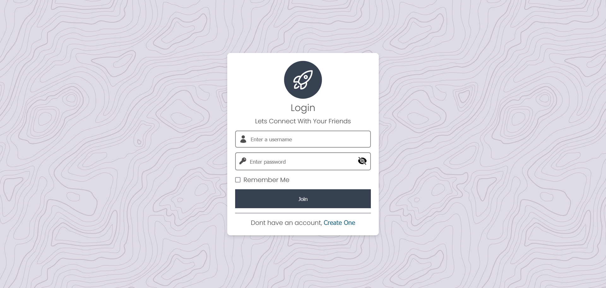
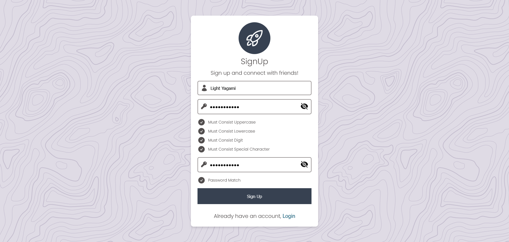

# Chat Application Using Socket IO

## Overview

This is a chat application built using Express, React, PostgreSQL, and Socket.IO. It allows users to communicate in real-time using a web interface.

## Prerequisites

Before running the application, ensure you have the following installed:

- [Node.js](https://nodejs.org/) (version 18 or above is recommended)
- [Docker](https://www.docker.com/)
- [Docker Compose](https://docs.docker.com/compose/install/)

## Installation

1. **Clone the repository:**

    ```bash
    git clone <https://github.com/your-username/chat-application.git>
    cd chat-application
    ```

2. **Install dependencies For Frontend:**

    ```bash
    - cd backend && npm i
    ```

3. **Install dependencies For Backend:**

    ```bash
    - cd backend && npm i
    ```

## Running the Application

### Backend

1. **Navigate to the backend directory:**

    ```bash
    cd backend
    ```

2. **Start the database server:**

    ```bash
    npm run db:dev:restart
    ```

3. **Start the backend server**

    ```bash
    npm run start
    ```

### Frontend

1. **Navigate to the backend directory:**

    ```bash
    cd frontend
    ```

2. **Start the application:**

    ```bash
    npm run start
    ```

3. **Open the application in your browser:**
    Navigate to `http://localhost:3000` to access the chat application.

## Screenshots

### Login Page



### Signup Page



### Chat Page


